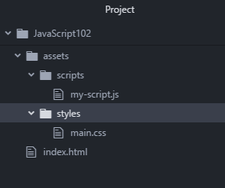

1. Using Chrome, [download the zip file from the GitHub repository](https://github.com/KansasCityWomeninTechnology/javascript-102/archive/master.zip). 

2. Extract the contents and copy the _index.html_ and "assets" folder to "CodingAndCocktails/JavaScript102" folder. Your "JavaScript102" folder should contain the following files and folders:

   

   
If you don't have a "CodingAndCocktails/JavaScript102" folder, take a moment to [set up your workspace](/setup).
   

   
Not sure how to extract the contents of the zip file?

**Mac users**: Double click on the downloaded file with the .zip extension 
**Windows users**: Right click on the file with the .zip extension and choose "Extract All." Select the destination you would like to extract the files to.
      

1. Open the "JavaScript102" folder in Atom.
   
To open the folder in Atom, follow the instructions below:
   1. Open Atom 
   2. Select **File** <i class="fa fa-long-arrow-right"></i> **Open Folder**
   3. Navigate to your "CodingAndCocktails" folder and select the "JavaScript102" folder

   You can close all tabs that Atom displays. Open _index.html_ and _my-script.js_ located in the "assets/scripts" folder. We will use both files tonight.
     

1. We will use the atom-live-server package we installed to serve the _index.html_ file. This package opens up the web page in your default web browser and reloads the page whenever you save files. Start the live server by selecting **Packages** <i class="fa fa-long-arrow-right"></i> **atom-live-server**. Select **Start server**. A browser tab will open.
   
If you don't have the atom-live-server package, take a moment to [set up your workspace](/setup).
      

   
If the tab opens in another browser, copy the URL and paste it into a new tab in Chrome. The reload will automatically happen in Chrome.

If you get an access warning, click "Allow" to let atom-live-server serve the application.
      
