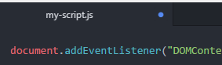

1. Using Atom, open _my-script.js_ in the "assets/scripts" folder. 

  
Two functions are already defined in the file: one function associated with the DOM content load completion event.  That function accepts an event as the input parameter. The second function is included to handle the click event on the HTML element with the id of `order-btn`. The second function currently has no input parameters passed to it. Both functions are lacking code in the function body - let's get to adding some!
  

2. Find the `onclick` event handler on line 4. Place your cursor between the opening and closing curly braces (these: `{}`) and press `Enter`. 

  Your cursor will be on a new line in between those curly braces that denote the function body.  Notice how Atom indents your cursor position as well.  This is to help with code readability. Your code should now look similar to this:
   ```javascript
document.getElementById('order-btn').onclick = function () {
};
   ```
   
The opening and closing curly brace signify the starting and ending boundaries for groups of code statements. All the code inside the curly brace are part of the same group. Code outside of the curly braces are not part of the group. In this case, all code inside the curly braces are part of a function and all code outside of the curly brace is not part of the function. You will see instructions to add code inside and outside functions tonights.
         

   
View the worksheet and the **IDE** (**I**ntegrated **D**evelopment **E**nvironment - a generic term for where you write your code, Atom is serving as the IDE in our case) in split screen mode to make it easier to work through tonight's session. Check out the [helpful tips in the Setup guide](/setup#tips). 
   

1. Add an alert with the message "Hi LadyDev!" inside the function body to verify we wired up the click handler correctly. Your click handler should look like this:
   ```javascript
document.getElementById('order-btn').onclick = function () {
      alert("Hi LadyDev!");
};
   ```

1. Save your file. 

   
**Every time you make a change, save the file.** 

The atom-live-server package will automatically refresh the Chrome tab to keep the app up to date with your **saved** work. Atom alerts you to unsaved work by displaying a blue circle in the tab:



Save the file by navigating to **File** <i class="fa fa-long-arrow-right"></i> **Save** or by using the keyboard shortcut `cmd` + `s` for Macs and `ctrl` + `s` for Windows. Refer to [Helpful Keyboard Shortcuts](/references).
   

1. In Chrome, click on the order button. Do you see the alert pop up? 

  
If you don't see the alert pop up when you click the button, double check that you've saved your files and grab a mentor if you're stuck!
  
  
  Great! We've got a form on our page that accepts user input to work with. Now that we know the click handler works, let's get the value of the form input!

1. In Atom, remove the alert code. 

1. First we need to select the HTML element that represents the form input. In the `onclick` function body (that area inside the curly braces!), type `document.getElementById('order-form-input')`.

1. Open the _index.html_ file and take a look at line 70.  You should see an HTML element for input with an `id` attribute of `order-form-input`. This is the element we just targeted in the previous step.

  
Need an HTML refresher? Grab a mentor or review the Coding & Cocktails [HTML Slides](http://bit.ly/CnCJanSlides) or [Worksheet](http://bit.ly/CnCJanWork)!
  

1. Next, in the _my-script.js_ file, ensure we get the value entered in that form input element.  Any guesses how we might do that? 

  Your click handler function should now look like this:
   ```javascript
document.getElementById('order-btn').onclick = function () {
      document.getElementById('order-form-input').value;
};
   ```

1. Wrap the value of the form in the `console.log()` method to see what the value of the input is. 

  You could add another alert message, or log it out to the console to do so.  Since we used the alert method already, try using `console.log()` here.  Your `onclick` function body should look like this:
   ```javascript
console.log(document.getElementById('order-form-input').value);
   ```

1. In Google Chrome, open the Chrome DevTools by using keyboard shortcuts `cmd` + `option` + `i` on Macs, `F12` on Windows, and `ctrl` + `shift` + `i` on Chromebooks. 

1. Enter text in the name form field and click on the order button. You should see your text write to the DevTools console. Leave DevTools open.  

1. In Atom, place your cursor at the top of the _my-script.js_ file and press `Enter` twice.  Place your cursor back on the first line of the file and create a constant variable named `submitOrder`. This will be your new function's name.
   ```javascript
const submitOrder
   ```

1. Next to the `submitOrder` variable, add an `=` sign to set your variable to some content.  Type the `function` keyword to start your function definition.

1. Add the open and close parenthesis for the area where you enter the input parameters for the function and add a single parameter called `name` as input to this function. 

1. Wrap up the function structure by adding the open and close curly braces `{}` and a semi-colon to end the line of code. Your function should look like this:
  ```javascript
const submitOrder = function (name) {};
  ```

1. The click handler function needs to call our new `submitOrder` function. Replace the `console.log` text with `submitOrder` in the click handler function. The click handler function body should look like this:
   ```javascript
submitOrder(document.getElementById('order-form-input').value);
   ```
   
We are passing the value as a parameter to the `submitOrder` function. We can now access the value of the form input in the `submitOrder` function body using the variable `name`. 
      

1. Inside the `submitOrder` function, add an alert on `name` to verify we wired it up correctly and save your work. 

1. In Chrome, try testing this out to see the alert pop up with the value you enter in the name field.
   
<details>
<summary>
Need a little help? Expand this section for guidance. 
</summary> 
Change the <code>submitOrder</code> function to
<pre>
<code class="lang-javascript">
const submitOrder = function (name) {
      alert(name);
};
</code>
</pre>
</details>
   

  
Notice we can leave the name blank. The value will be empty but the alert still displays with nothing inside.  
     

1. Great! Now we can update the DOM with information about the order in the `submitOrder` function. We should also append extra text to their name so it sounds friendly. We can do this using **string concatenation**. In Atom, remove the alert message from the `submitOrder` function body and replace it with
   ```javascript
document.querySelector('.order-details').innerHTML = name + " would like a drink!";
   ```
  
We are using `document.querySelector` here instead of `document.getElementById`. We are querying for the class `order-details` instead of the element id. The `Document` API has different ways to find and access elements from the DOM depending on what you are trying to access and how many elements fit the criteria of the search. Check out the references for the section to read more about the different ways to access elements in the DOM. 
     

1. In Chrome, try adding your name and click the order button. Do you see your name added to the web page?
   
You will use Atom to type code statements and Chrome to verify your work when your web page reloads. Don't forget to save _my-script.js_ every time you type a code statement.
   

