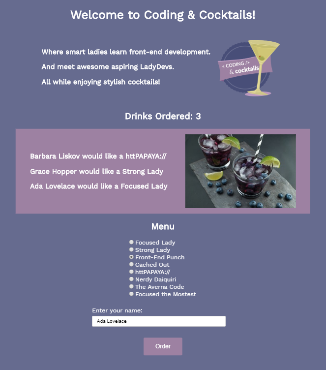

# A Deeper Dive into JavaScript {#top}
We will start by practicing JavaScript fundamentals and diving deeper into DOM manipulation before we explore new concepts such as events, objects, and APIs. JavaScript is one of many programming languages used for application development.

Tonight we will create an web application with interactive elements and dynamic content that looks like this: JAD TODO: ADD PICTURE

<!-- trick markdown to give me a little space between these two sections of text -->
## 

Before starting the worksheet, please take a moment to review [Setup instructions](/setup) to ensure you have all the tools and workspace setup you need for tonight's work.


<!-- trick markdown to give me a little space between these two sections of text -->
## 

If you are using a Chromebook, please skip to the [Chromebook instructions](#chromebook-instructions) below!


<!-- trick markdown to give me a little space between these two sections of text -->
## 
This section will help guide you through the following steps:



## Prepare your workspace and serve your web page {#prepare} <a href="#top" title="Take me to the top of page"><i class="fa fa-chevron-circle-up" aria-hidden="true"></i></a>


## Create a function and update the text of an element {#text} <a href="#top" title="Take me to the top of page"><i class="fa fa-chevron-circle-up" aria-hidden="true"></i></a>
We'll write a function that updates the DOM dynamically with text


## Add a counter and update the DOM element text {#counter} <a href="#top" title="Take me to the top of page"><i class="fa fa-chevron-circle-up" aria-hidden="true"></i></a>


## Add conditional logic to display an alert {#conditional} <a href="#top" title="Take me to the top of page"><i class="fa fa-chevron-circle-up" aria-hidden="true"></i></a>


<!-- trick markdown to give me a little space between these two sections of text -->
## 

## Checkpoint <a href="#top" title="Take me to the top of page"><i class="fa fa-chevron-circle-up" aria-hidden="true"></i></a>
Compare your _scripts.js_ against the answer key for your work so far. It might look a little different depending on spacing.  


<!-- trick markdown to give me a little space between these two sections of text -->
## 
## References and helpful links <a href="#top" title="Take me to the top of page"><i class="fa fa-chevron-circle-up" aria-hidden="true"></i></a>
[What is a programming language video](https://vimeo.com/250067069)

[JavaScript data types](https://developer.mozilla.org/en-US/docs/Web/JavaScript/Data_structures)

[JavaScript operators](https://developer.mozilla.org/en-US/docs/Web/JavaScript/Reference/Operators/Arithmetic_Operators)

<!-- trick markdown to give me a little space between these two sections of text -->
## 

<!--sec data-title="Chromebook instructions" data-id="section1" data-show=true data-collapse=true ces-->

<!--endsec-->
