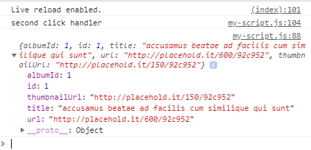

1. Declare a new function called `fetchImage` in the global scope after the `updateOrderCount` function.
   
<details>
<summary>
Need a little help? Expand this section for guidance. 
</summary> 
Add <code>const fetchImage = () => {}; </code> after the <code>updateOrderCount</code> function.
</details>
   

1. Inside the `if` statement in `submitOrder` function, add a call to `fetchImage();` before creating the node.

1. Inside the `fetchImage` function, declare a new `const` variable called `url`. Assign the value to 'https://jsonplaceholder.typicode.com/photos/1'.
   
Let's break down the parts of the URL.

**Scheme**- `http` or `https`- Most APIs use `https` for security reasons and uses encryption under the covers.

**Host**- `jsonplaceholder.typicode.com`- This is the main domain of the URL.

**Path**- `/photos/1`- This is a unique endpoint to retrieve the resource. JSONPlaceholder also has endpoints for `/users`, `/todos`, `/albums`, among others.
   

1. Let's call `fetch()`. Inside the `fetchImage` function, add the following code to call `fetch` and log the output.
   ```javascript
fetch(url)
      .then((response) => { return response.json(); })
      .then((json) => {
            console.log(json);
       })
       .catch( (error) => { console.log(error); });
   ```
  
Let's walk through what we did here.

On the first line, we call `fetch` API built into JavaScript and pass in the `url` parameter we defined. The `fetch` API returns a **Promise** object.

**Promises** allow you to work with objects **asynchronously** and used for control flow, much like an if/else statement. **Promises** have 2 methods available: `then` and `catch`. Check out the references to read more about Promises.

When the `fetch` Promise resolves, we `then` process the Response we get by converting it to `json`. The output from `then` is another Promise. We `then` take the `json` output and log it to the console. In case of an error, we `catch` and log it out to the console.

ECMAScript2017 now has `async` and `await` as new ways to work with **asynchronous** output and works alongside Promises. We'll learn more about `async` and `await` in a future session. 
   

1. In Chrome, add a drink order and take a look at the console. Do you see a **JSON** object? It looks like the objects we created tonight with keys and values. Feel free to inspect the object in the console.

   
