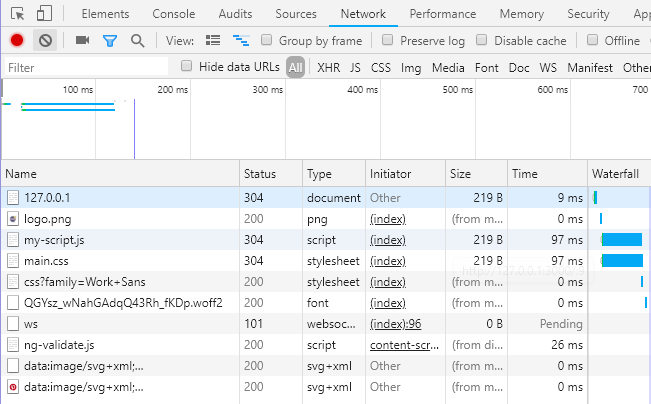
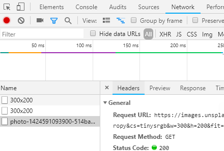

1. Inside the `fetchImage` function, modify the `url` variable by assigning the value to 'https://source.unsplash.com/collection/2187331/300x200'.
   
The Unsplash API takes an optional parameter in the **PATH** for the image size. The '300x200' is the size of the image we want to retrieve. You can look at the API documentation we are using at [https://source.unsplash.com](https://source.unsplash.com/).
   

1. We need to change the `fetch` call to handle a `Blob` instead of `json`. Update the **Promise** from the `fetch` call to look like this
   ```javascript
fetch(url)
      .then((response) => { return response.blob(); })
      .then((blob) => {
            console.log(blob);
       })
       .catch( (error) => { console.log(error); });
   ```

1. In DevTools, open the **Network** tab. In this view we see all the requests the web page made. We can see where the _index.html_ loaded the assets such as _my-script.js_ and _main.css_ and the images references in the _index.html_ such as the logo.
   
   

1. We can clear existing requests to make it easy to capture the network calls we're interested in. Press  **Clear** button to clear out any existing network requests. Place a drink order and click the order button. You'll see network requests made. Click on the line that has the word "photo". You see tabs for **Headers**, **Preview**, **Response**, and **Timing**. You can click on those tabs to see different information about the request.

   

1. In Chrome, add a drink order and take a look at the console. Do you see a `Blob` object? Feel free to inspect the object in the console.
   
How does the `blob` object compare to `json`?
   

1. Inside callback for `fetch`, below the `console.log(blob);`, add the following code to connect the image url.
   ```javascript
const imgUrl = URL.createObjectURL(blob);
document.getElementById('cocktail-image').src= imgUrl;
   ```
1. In Chrome, add a few drink orders.
