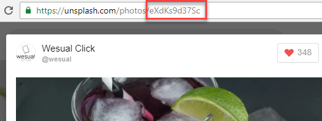

1. In Chrome, open a new tab to [https://unsplash.com/collections/2187331/cocktails](https://unsplash.com/collections/2187331/cocktails) to view all the cocktails in the collection we using in the `fetch` call. Click on an image of your choosing. 

1. Notice the url changes to include the photo id `https://unsplash.com/photos/<PHOTO_ID>`. Copy the photo id. It will look like `eXdKs9d37Sc`.
   
   

1. In _my-script.js_, add a new property to the first object in `drinkArray` by placing your cursor after the closing single quote on `'label': 'Focused Lady'`. Add a comma and press `Enter`. Add a new property called `photoId` using the photo id you copied. Your object will look like this
   ```javascript
drinkArray: [{
      'id': 'focusedLady',
      'label': 'Focused Lady',
      'photoId': 'eXdKs9d37Sc'
},
// other drinks here
]
   ```
   
You can add as many properties as you want on an object. Here is an example of the power of building up the menu in JavaScript using the array of objects. We now have a way access extra information about drinks that we want. If we left the code in the HTML to build the drink menu radio buttons, adding this functionality becomes much harder to do.
   

1. Find photos and add their `photoIds` to the remaining drink objects. 

1. We now have the photo ids, but need a way to retrieve the `photoId`. We can do so if we access the drink object in the array. We can lookup array elements by their id. In the first `click` event listener at the bottom of the file where you where you call `submitOrder`, change the variable `drinkName` to `drinkId` and pull the `id` property from the element. Your code will look like this
   ```javascript
const drinkId = document.querySelector('input[type="radio"]:checked').id;
   ```
   
When we created the drink menu in the `buildDrinkMenu` method, we added drink's id to the HTML element. Now we can take advantage of it.
   

1. Update the call to `submitOrder` function in the `click` event listener to send the parameters `orderName, drinkId`.

1. The `submitOrder` function expects the name on the order and the name of the drink, but it no longer matches what the `click` event listener sends in. Rename the `drink` parameter to `drinkId`.

1. Now that we have the `drinkId`, we can use it to lookup the menu's drink object. We can use a built in `find` method when working with arrays. In the `submitOrder` function, inside the `if` statement, before the call to `fetchImage` type the following code
   ```javascript
const drinkObject = menu.drinkArray.find( (arrayElement) => { 
      return arrayElement.id === drinkId; 
});
    ```
   
Let's talk through what's going on. We call `find` on `drinkArray`. The `find` method iterates over the array elements and returns the first element in the array that satisfies the condition defined in the `return` statement. We get the array element as a parameter and check if the array element strictly equals `drinkId`. Feel free to write to console or debug the web app to see how this works.
   

1. The `drinkObject` variable contains the drink object. Pass the drink's `photoId` into the call to `fetchImage()` inside the `submitOrder` function. The call to the `fetchImage` function should look like this:
   ```javascript
fetchImage(drinkObject.photoId);
   ```

1. Before we forget, in the `submitOrder` function update the string template that builds the order details to reference the `drinkObject`'s drink name. 
   
<details>
<summary>
Need a little help? Expand this section for guidance. 
</summary> 
Update the <code>const textNode = document.createTextNode(`${name} would like a ${drink}`);</code> with 
<pre>
<code class="lang-javascript">
const textNode = document.createTextNode(`${name} would like a ${drinkObject.label}`);
</code>
</pre>
</details>
   

1. In the `fetchImage` function, add a function parameter called `photoId`.
   
<details>
<summary>
Need a little help? Expand this section for guidance. 
</summary> 
Replace the <code>const fetchImage = () => {...}</code> with 
<pre>
<code class="lang-javascript">
const fetchImage = (photoId) => {...}; 
</code>
</pre>
</details>
   

1. Update the `url` variable in `fetchImage` to use the photo id. The API expects the URL in this format: 'https://source.unsplash.com/PHOTO_ID/300x200'. Update the `url` variable using template literals to include `photoId`.
   
<details>
<summary>
Need a little help? Expand this section for guidance. 
</summary> 
Replace <code>const url = 'https://source.unsplash.com/collection/2187331/300x200';</code> with 
<pre>
<code class="lang-javascript">
const url = `https://source.unsplash.com/${photoId}/300x200`;
</code>
</pre>
Don't forget the backticks!
</details>
   

1. In Chrome, add a few drink orders. Does your photos match up with what you chose earlier?