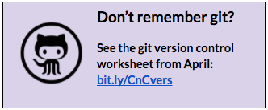
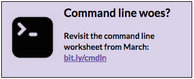

# Project {#project}

We are going to utilize the drink order app that some of you may have seen during our March version control session or our June jQuery session.  We’re going to make it interactive and utilize the concepts we discussed tonight.

  